# Spark & Big Data Project 🚀

## 📌 Overview
This repository contains my implementation of a **Big Data Assignment** using **Apache Spark on GCP Dataproc**.  
I used **Scala, Spark DataFrames, SQL, and HDFS** to perform various transformations and queries.

## 🛠 Technologies Used
- **Apache Spark**
- **Scala**
- **Google Cloud Dataproc**
- **HDFS (Hadoop Distributed File System)**
- **Spark SQL**

## 📂 Project Structure
```
📂 Spark-BigData-Assignment
 ┣ 📜 foodratings.csv (Example Data)
 ┣ 📜 foodplaces.csv (Example Data)
 ┣ 📜 spark_assignment.scala (Scala Code)
 ┣ 📜 README.md
 ┣ 📂 screenshots
 ┃ ┣ 📜 foodratings_schema.png
 ┃ ┣ 📜 foodplaces_schema.png
 ┃ ┣ 📜 foodratings_ex3a.png
 ┃ ┗ 📜 ex6_inner_join.png
```

## 📊 Features Implemented
✔ **Loaded and Processed CSV Data into Spark DataFrames**  
✔ **Registered DataFrames as SQL Tables & Executed Queries**  
✔ **Performed DataFrame Transformations (`filter`, `select`)**  
✔ **Executed an Inner Join on `placeid` between `foodratings` & `foodplaces`**  

## 🎯 Key Learning Outcomes
- Understanding **Big Data Processing** with **Apache Spark**
- Writing **optimized queries** using **Spark SQL**
- Applying **HDFS storage concepts** to manage data at scale
- Using **Scala & DataFrame APIs** for data transformations

## 🚀 How to Run
1. **Clone this repository**
```sh
git clone https://github.com/yourusername/Spark-BigData-Assignment.git
```
2. **Run it in Spark-Shell**
```sh
spark-shell
:load spark_assignment.scala
```

## 📷 Screenshots
1. **Exercise**
```
- Setting	up	to	Use	Spark	in	Dataproc:	
- Start up a Hadoop cluster and type spark-shell 
- Type this ```spark-shell```
```
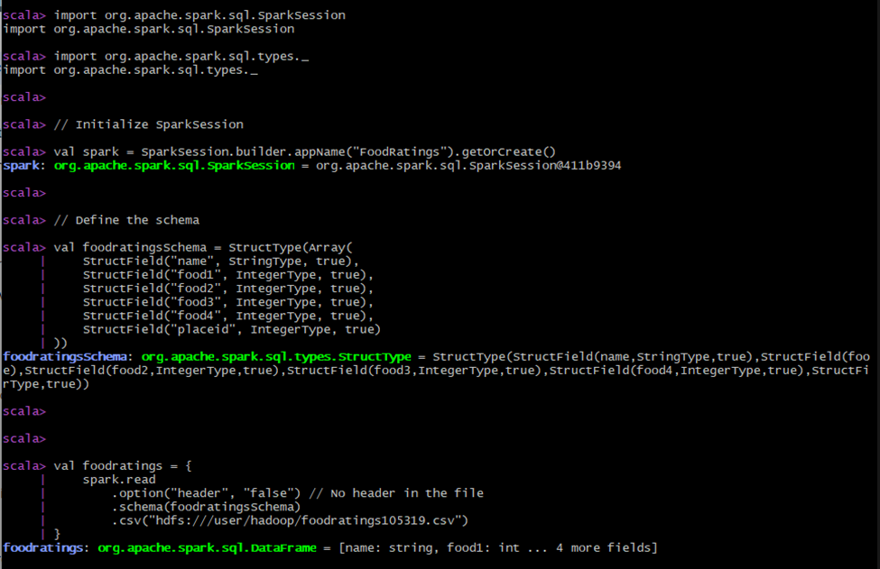
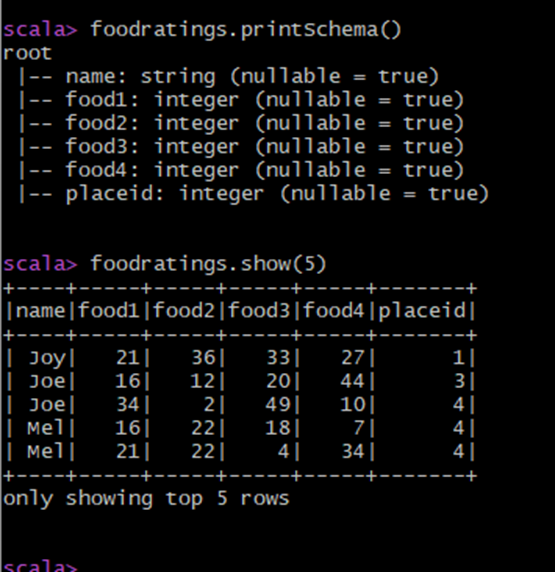

2. **Exercise** 
```
- Load the ‘foodplaces’ file as a ‘csv’ file into a DataFrame called foodplaces.
- When doing so specify a schema having fields of the following names and types: 
```

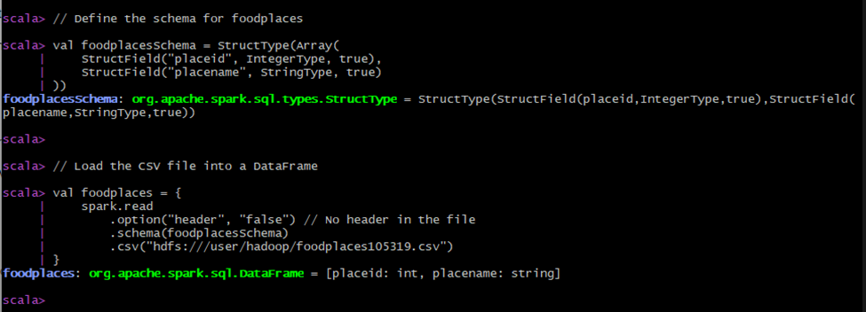
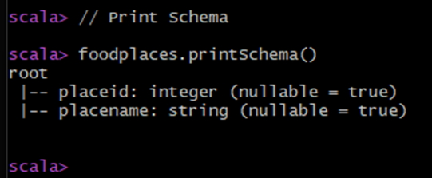
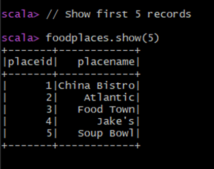

3. **Exercise** 
```
- Register the DataFrames created in exercise 1 and 2 as tables called “foodratingsT” and 
“foodplacesT”
```

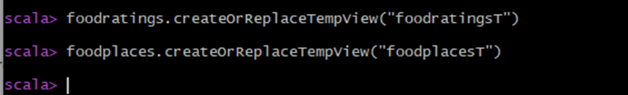
```
- Use a SQL query on the table “foodratingsT” to create a new DataFrame called 
foodratings_ex3a holding records which meet the following condition: food2 < 25 and food4 > 40.
- Remember, when defining conditions in your code use maximum parentheses. 
```
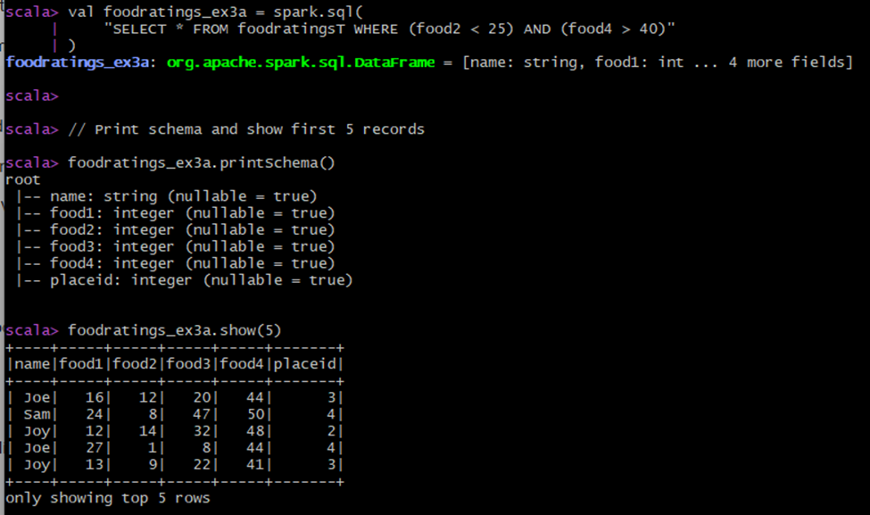
```
- Use a SQL query on the table “foodplacesT” to create a new DataFrame called 
foodplaces_ex3b holding records which meet the following condition: placeid > 3
```
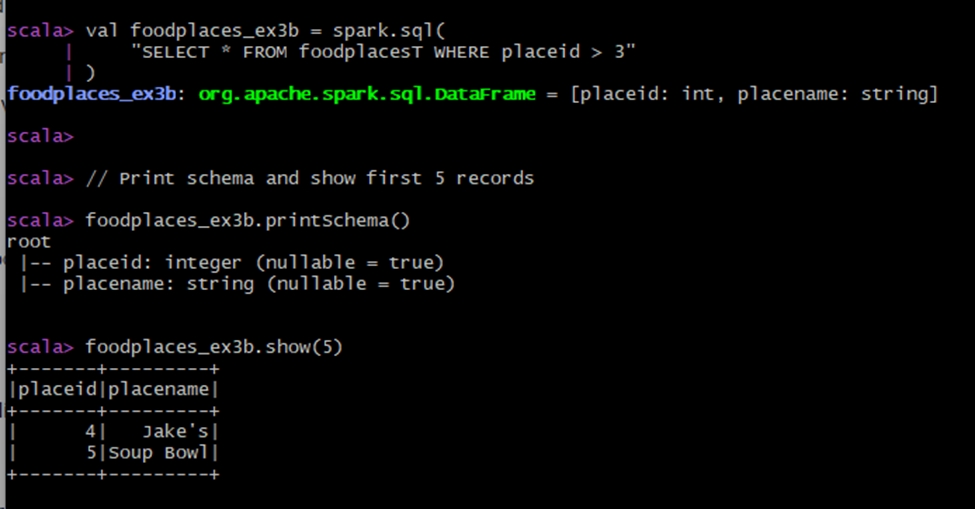

4. **Exercise**
```
- Use a transformation (not a SparkSQL query) on the DataFrame ‘foodratings’ created in 
exercise 1 to create a new DataFrame called foodratings_ex4 that includes only those records 
(rows) where the ‘name’ field is “Mel” and food3 < 25. 
```
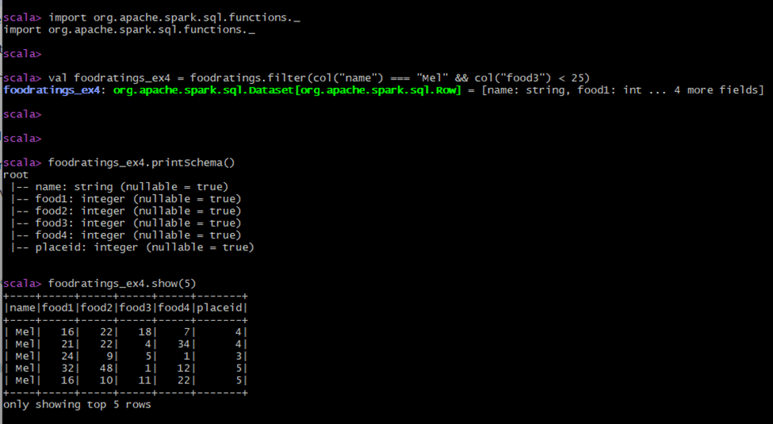

5. **Exercise**
```
- Use a transformation (not a SparkSQL query) on the DataFrame ‘foodratings’ created in 
exercise 1 to create a new DataFrame called foodratings_ex5 that includes only the columns 
(fields) ‘name’ and ‘placeid’ 
```
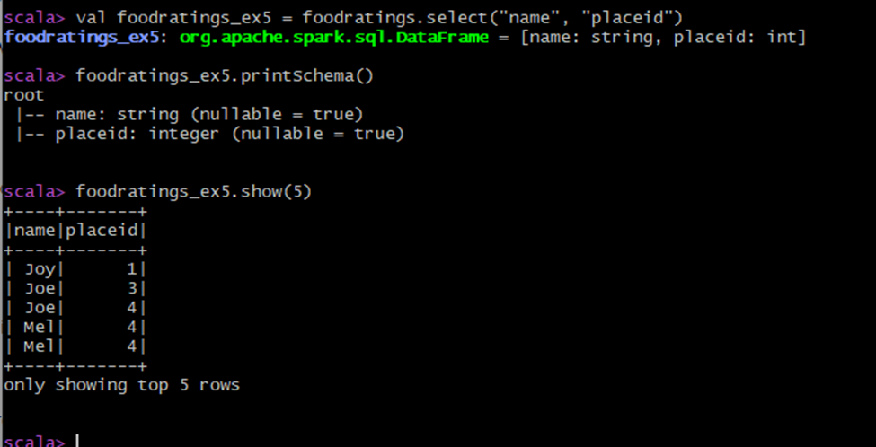

6. **Exercise**
```
- Use a transformation (not a SparkSQL query) to create a new DataFrame called ex6 which is 
the inner join, on placeid, of the DataFrames ‘foodratings’ and ‘foodplaces’ created in 
exercises 1 and 2 
```
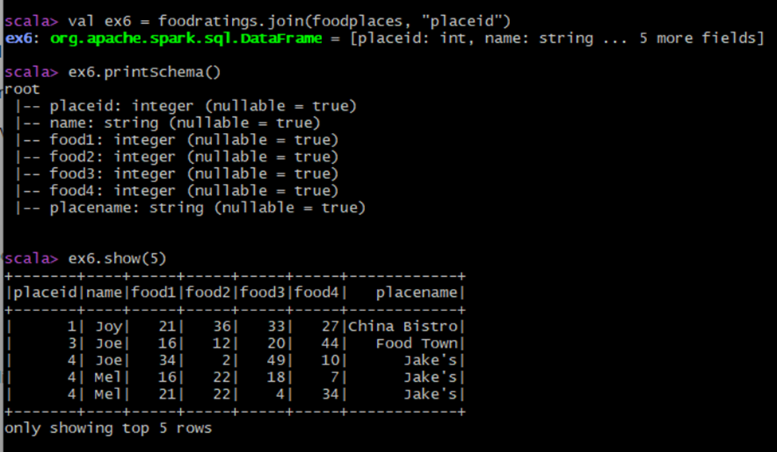